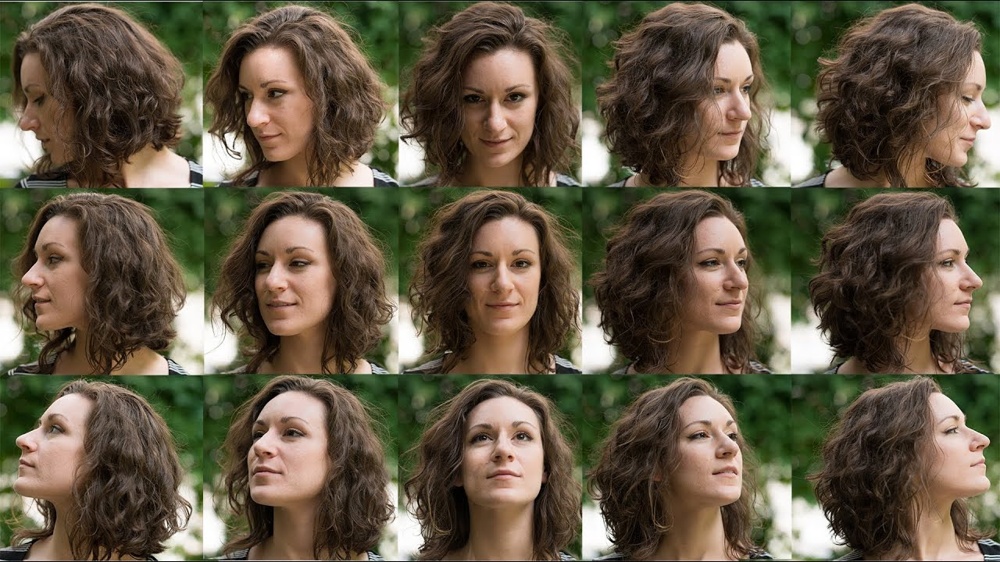

# Machine Learning Engineer

## Technical Skills
- Programming Languages: Python, JAVA, SQL, C Language, Apex (Salesforce)
- ML tools & frameworks: Pytorch, Scikit-Learn, Matplotlib, Pandas, Numpy, OpenCV, Plotly
- ML techniques: Regression Analysis, Predictive Analysis, Classification, Decision Trees, SVM, PCA, Deep
- Learning techniques, Transformers, Computer Vision, 3D Reconstruction, ETL, Time-Series Analysis, MLOps
- Others: Git, Docker, Prompt Engineering, Power BI, JiRA, COPADO

## Master Thesis
**Title:** Analyzing the Input Sensitivity in Neural and Gaussian Splatting Methods for 3D Modelling of Human Head

Explores the optimization of input parameters vital for high-fidelity 3D reconstruction of the head, resulting in the Chamfer distance of ~5 mm between the reconstructed head and the ground truth.
Conducted experiments with 20+ SOTA 3D surface reconstruction methods based on Neural Radiance fields and Gaussian Splatting under challenging conditions such as sparse settings (3, 5, and 7 images).
Quantified the robustness of these advanced techniques with different inaccuracies (Gaussian noise and low-intensity light) to determine which methods excel in real-world conditions.
Demonstrated that various forms of input corruption have varying impacts on the completeness of reconstructed 3D models.

## Work Experience
**Salesforce Solution Architect, Brose, Germany**  
*Feb 2023 - Present*

- Implemented automated solutions in Salesforce for enhanced case resolution, significantly accelerating response times and improving customer satisfaction.
- Collaborated with cross-functional teams to translate complex requirements into scalable actionable solutions, ensuring seamless integration in the Brose Service Tool.
- Designed an automation script to remove Salesforce licenses from inactive users, leading to a 20% decrease in operational expenses.

**Research Assistant, Friedrich-Alexander-Universität Erlangen-Nürnberg**  
*Nov 2021 - Jan 2023*

- Assisted in cutting-edge research on deep learning and computer vision, focusing on 3D reconstruction and neural networks.
- Published research findings in reputable conferences and journals.
- Developed and maintained machine learning models for various research projects.

**Salesforce Developer, TATA Consultancy Services, India**  
*Jul 2018 - Sep 2021*

- Automated the data cleansing process by developing an Apex batch script, reducing the manual effort by 20%.
- Customized Salesforce features using Apex classes, Triggers, and Visualforce pages. Built CPQ price rules for rollouts in 20+ countries, handled over 10,000 complex products, and used SOQL scripts for fast data retrieval, enhancing data quality and reducing duplications.
- Managed large-scale data migrations using Data Loader and Workbench tools, utilized DevOps tools like Jira, Copado, and Microsoft Office for project management, and ensured version control by maintaining code repositories.

## Publications
- Published and presented my paper titled "PoseBias: On Dataset Bias and Task Difficulty - Is there an Optimal Camera Position for Facial Image Analysis?" in the prestigious ICCV 2023 Workshop held in Paris.
- Authored a technical paper titled "Home Automation Using Panoramic Image Using IoT," published in the renowned IEEE Journal in 2018.

## Projects

###  Title: Get Fit with PCA [Report](https://github.com/mohit-choithwani/Get_Fit_with_PCA/blob/main/Fitness%20App.pdf)
- Developed a computer vision-based fitness monitoring application that analyzes exercise videos to evaluate and score the accuracy of performed exercises.
- Implemented landmark extraction using the MediaPipe library to precisely detect body positions from video, followed by normalization of these landmarks through rigid alignment.
- Constructed a PCA model using Singular Value Decomposition on the normalized landmarks to capture essential movement parameters, assessing exercise accuracy by comparing the L2 norm against a set threshold for real-time evaluation.

##  EDUCATION

**University of Erlangen-Nuremberg, DE**  
*Oct. 2021 - Sep. 2024*  
Master of Science in Data Science, Majors in AI & ML

**University of Mumbai, IN**  
*June 2014 - June 2018*  
B.E. in Computer Engineering

## Certifications
- Salesforce Admin (2020)
- Salesforce Platform Developer I (2020)
- Salesforce CPQ Specialist (2021)
- Salesforce Advanced Admin (2021)
 
